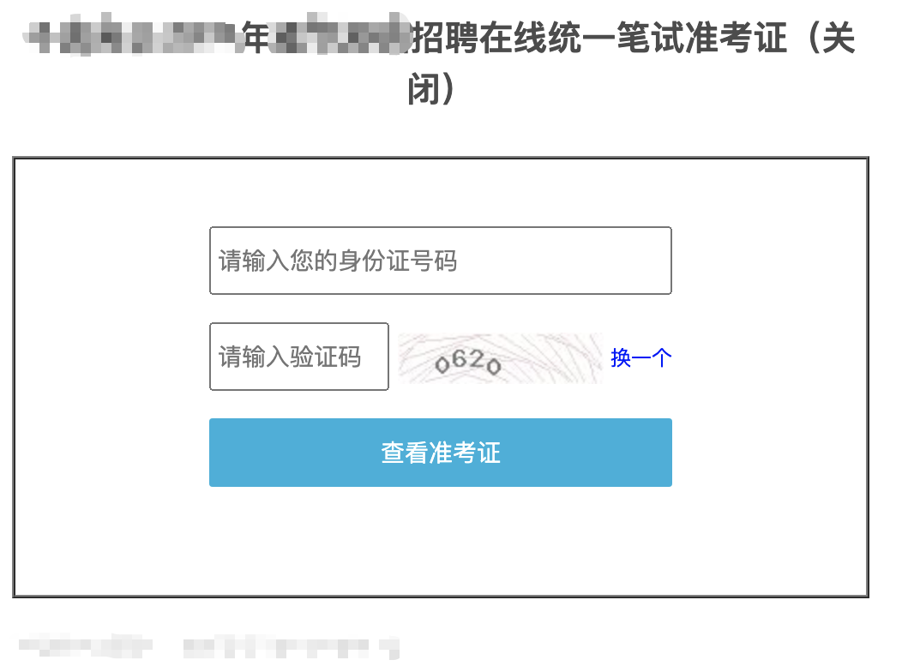
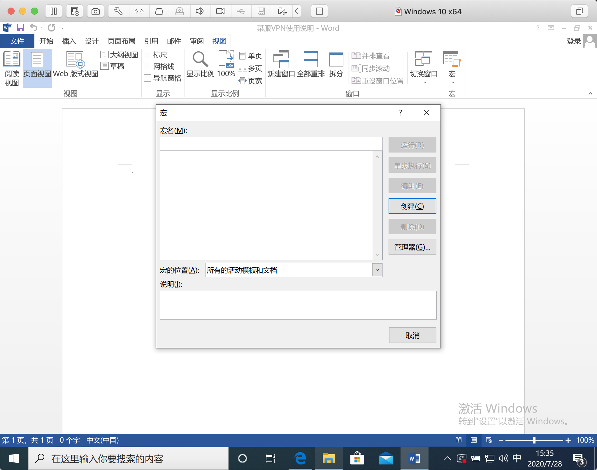

# Cobalt strike 钓鱼之求职邮件
钓鱼钓鱼，想要钓上鱼就得结合时事来进行构造，最近由于疫情原因大家的复工率都很低，就业成为了很多人的问题，因此我们就伪造一份线上笔试的邮件来对某些人进行钓鱼攻击。  
## 1. 克隆网站
钓鱼页面的目的就是获取你想要得到的信息，以前的钓鱼都是输入账号密码啥的，导致很多人在账号密码页面会很警惕（虽然也没有多警惕），我们这次换个思路，收集身份证信息。像下面这个网站这样

首先，依次点击**attacks -> web drive-by -> clone site**,如下图所示。

然后，在url内填写需要克隆的网站url，最后勾上记录键盘的选项。然后网站就搭建成功了，直接访问就行了

有一说一，还是蛮真的，验证码都有了。

## 2. 生成word宏病毒
我们可以利用CS的攻击模块生成一个word宏病毒。  
依次点击**attacks -> Packages -> MS Office Macro**,如下图所示。

选择一个监听器，然后生成

创建一个宏

黏贴剪切栏的内容到目标的Word文件的宏内。

记得删除原有的内容

保存退出宏木马就生成好了，记得起一个合适的名字，增加钓鱼的成功率。

打开文件，cs上就能看到机器上线了。

## 3.生成钓鱼邮箱
依次点击**attacks -> Spear Phish **,如下图所示。  

编写一份被攻击者的列表，格式为：  
someone@xx.com[TAB]name   
someone2@xx.com[TAB]name2   
  
然后在[https://cock.li/](https://cock.li/)上注册一个邮箱来进行邮件钓鱼。  
最后填写spear phish内选项，发送邮件

- targets是目标
- template是邮件模板
- Attachment是附件内容
- embed url是邮箱内链接的地址
- mail server填写你刚刚注册的邮箱服务器的信息
- bounce to是抄送地址  
最后我们就可以收到自己的钓鱼邮件啦，虽然是在垃圾邮件里。等着机器上线就好了。

**Tips**：Word内的内容写的尽可能正式点会减少受害者的警惕性，不要像我一样瞎写。

### 钓鱼邮件内容分析

正所谓知己知彼百战不殆，钓鱼作为一个最常见的攻击，除了使用邮件安全防护技术，我们还可以从邮件内容中发现一些可疑点

1. 真实发送地址与宣传发件人地址不一致
2. 在邮件原文的附件位置可以发现CS的指纹